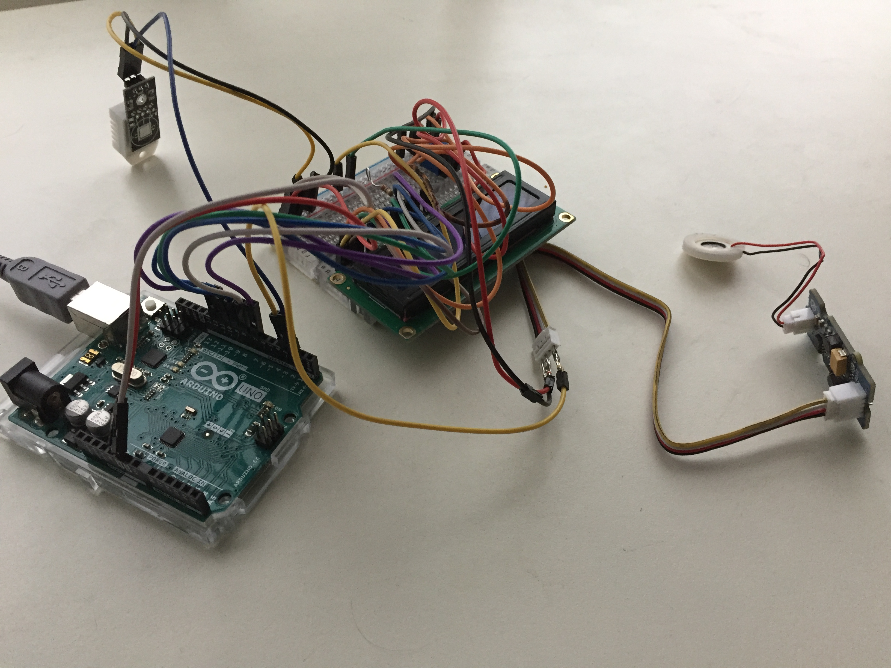
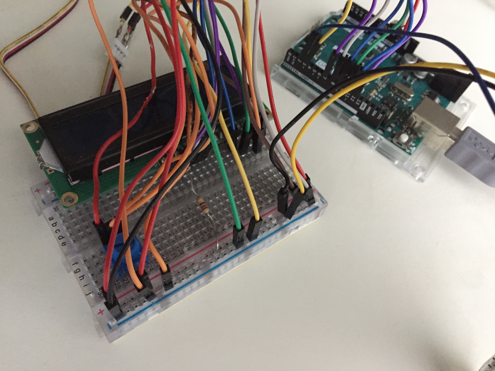

# Electronics-arduino
Electronics project, that uses Arduino to

* Measure temperature, humidity with DHT22

* Display with 16X2 LCD

* Maintain a certain humidity with grove water atomization

See theoretical notes/learnings in 'electronics_notes.txt'.

### PREPARE SOFTWARE
* Install arduino IDE: https://www.arduino.cc/en/software
* Open arduino IDE with main.cpp.ino
* Sketch -> include libraries -> liquidcrystal
* Sketch -> include libaraies -> include .zip -> DHTlib.zip
* Verify -> see if compilation succeeds

### PREPARE HARDWARE
* Connect prepared arduino to computer
* Upload arduino code on it

### CAUTION
Do not touch grove water atomizer middle part

### HARDWARE SETUP

